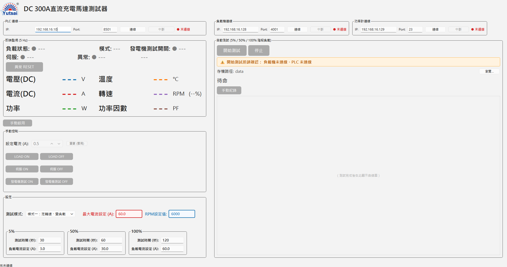

# DC 發電機量測系統 — UI 操作手冊

> 對象：操作本系統 GUI 進行 DC 發電機/充電馬達測試的現場人員
> 程式：`ui/main_window.py`（PyQt6），視窗標題「DC 300A直流充電馬達測試器」
> 整合儀器：PEL-5000C 電子負載、Keyence KV PLC、GPM-8310 功率計

本手冊只說明「畫面操作」。儀器接線、網路設定、CLI 測試腳本請看 `docs/使用手冊.md`。

---

## 目錄
1. [啟動程式](#1-啟動程式)
2. [畫面總覽](#2-畫面總覽)
3. [連線三台儀器](#3-連線三台儀器)
4. [即時監視區](#4-即時監視區)
5. [手動控制](#5-手動控制)
6. [兩種自動測試模式](#6-兩種自動測試模式)
7. [設定區](#7-設定區)
8. [執行自動測試](#8-執行自動測試)
9. [手動紀錄](#9-手動紀錄)
10. [輸出檔案](#10-輸出檔案)
11. [狀態燈與顏色對照](#11-狀態燈與顏色對照)
12. [按鈕啟用條件一覽](#12-按鈕啟用條件一覽)
13. [疑難排解](#13-疑難排解)

---

## 1. 啟動程式

在桌面上**雙擊應用程式捷徑「DC發電機量測系統」**即可啟動（執行檔為 `DCGenTester.exe`）。

- 程式預設安裝於 `%LocalAppData%\Programs\DCGenTester`（即 `C:\Users\<使用者>\AppData\Local\Programs\DCGenTester`）；`DCGenTester.exe` 與 `config.yaml` 放在同一資料夾。
- 視窗會以**最大化**開啟。
- 若 `config.yaml` 內 `plc.enabled: true` / `power_meter.enabled: true`，程式啟動時會**自動連線**該儀器；否則需手動按「連線」。
- 找不到 `config.yaml` 會跳出明確錯誤視窗 —— `config.yaml` 必須與 `DCGenTester.exe` 放在同一資料夾（用安裝精靈安裝時會自動處理）。
- 修改設定檔可從「開始」功能表的捷徑「編輯設定 (config.yaml)」開啟，或直接用記事本編輯該檔。
- 上次關閉前在 UI 輸入的設定（IP/Port、最大電流、RPM、各階段時間/電流/轉速、存檔路徑、測試模式）會自動還原（存於 Windows 登錄，不會改動 `config.yaml`）。

---

## 2. 畫面總覽

程式啟動後的完整畫面（三台儀器皆未連線時）：

畫面分左右兩欄：

- **左欄**：PLC 連線、即時監視、手動啟用、手動控制、設定。
- **右欄**：負載機連線 + 功率計連線、自動測試。
- **最底狀態列**：每次操作的結果提示（例如「LOAD ON」「已存檔」「連線失敗」），會在數秒後自動消失。

---

## 3. 連線三台儀器

每個連線框都有：`IP` 欄、`Port` 欄、「連線」鈕、「中斷」鈕、狀態燈（`● 未連線` 紅 / `● 已連線` 綠）。三台儀器各自獨立，連線/中斷互不影響。

| 連線框 | 位置 | 現場 IP : Port | 角色 |
|---|---|---|---|
| **負載機連線** | 右欄上 | `192.168.16.128 : 4001` | PEL-5000C 電子負載，讀 V/I/P、CC 控制、LOAD ON/OFF |
| **PLC 連線** | 左欄上 | `192.168.16.10 : 8501` | Keyence KV PLC，讀溫度/轉速/狀態、控制伺服/速度/發電機測試 |
| **功率計連線** | 右欄上 | `192.168.16.129 : 23` | GPM-8310，讀功率因數（PF） |

> ※ 上表為目前 `config.yaml` 內的現場設定值，三台同屬 `192.168.16.x` 網段；若現場 IP 變更，UI 連線欄可直接修改（會記住），或同步更新 `config.yaml`。

操作：
1. 確認 IP / Port 正確（會記住上次輸入值）。
2. 按「連線」。成功後狀態燈轉綠、IP/Port 欄鎖定、「連線」鈕變灰、「中斷」鈕可按。
3. 連線失敗只會在最底狀態列提示，不影響其他儀器。

> 連線成功後 IP/Port 欄會鎖住，要改需先「中斷」。
> 負載機一連上即進入遠端（REMOTE）並切到 CC 模式；中斷時會自動送 `LOAD OFF` + `LOCAL`（硬體安全網）。

---

## 4. 即時監視區

左欄「即時監視 (5 Hz)」，由負載機/PLC/功率計三條背景執行緒各自更新。

### 量測數值（兩欄六項）
| 項目 | 來源 | 單位 |
|---|---|---|
| 電壓(DC) | 負載機 | V |
| 電流(DC) | 負載機 | A |
| 功率 | 負載機 | W |
| 溫度 | PLC（DM7000） | °C |
| 轉速 | PLC（DM7006 主值；旁邊括弧為 DM7001 的 %） | RPM |
| 功率因數 | 功率計 | PF |

未連線或讀不到時顯示 `---`。功率計遇到超量程/無資料時，PF 會顯示 `0.0000` 但維持連線繼續輪詢。

### 狀態燈（兩行）
**第一行**
- **負載狀態**：`● LOAD ON`（綠）/ `● LOAD OFF`（灰）— 負載機輸出開關。
- **模式**：CC / CR / CV / CP — 負載機目前模式。
- **發電機測試開關**：`● ON`（綠）/ `● OFF`（紅）— PLC 繼電器（MR103）。

**第二行**
- **伺服**：`● ON`（綠）/ `● OFF`（紅）— 伺服馬達狀態（PLC DM7003）。
- **異常**：`● 正常`（綠）/ `● 異常`（紅）— PLC DM7004。右側「異常訊息」會逐 bit 解碼（bit0＝緊急停止、bit1＝馬達驅動器異常，其餘顯示 `bitN`）。

### 異常 RESET
位於「異常」狀態下一行的橘色按鈕。只要 PLC 已連線即可按（**不受測試中鎖定**），按下會送出 PLC 異常 RESET 繼電器（MR502）。

---

## 5. 手動控制

### 手動啟用（閘門）
「手動控制」框上方有一顆「手動啟用」按鈕，是整個手動控制區的**總閘門**。
- 只要 PLC 連線即可按；按下會切換 PLC 繼電器（MR102，ST/RS 交替）。
- 實際狀態以 PLC 回授（DM7005）為準：ON 時按鈕轉**綠**、整個手動控制框背景轉**淺綠**；OFF 時按鈕轉**藍**、框背景回原色。
- **手動啟用為 ON，框內的設定電流、LOAD、伺服、發電機測試按鈕才會啟用。**

### 手動控制框內的操作
| 控制 | 動作 | 啟用條件 |
|---|---|---|
| **設定電流 (A)** + 「變更(套用)」 | 把 CC 電流值寫入負載機（不重切模式） | 負載機連線 + 手動啟用 ON |
| **LOAD ON / LOAD OFF** | 負載機輸出開/關 | 負載機連線 + 手動啟用 ON |
| **伺服 ON / 伺服 OFF** | PLC 伺服繼電器（MR100）ON/OFF | PLC 連線 + 手動啟用 ON |
| **發電機測試 ON / OFF** | PLC 繼電器（MR103）ON/OFF | PLC 連線 + 手動啟用 ON |
| **速度設定 (RPM)** + 「速度設定」/「停止」 | 把 RPM 直接寫入 PLC（DM102） | PLC 連線 + **伺服 ON**（與手動啟用脫鉤） |

**速度設定列**只在 PLC 的速度控制來源為「自動控制速度」（DM7002=1）時才**顯示**；「手動控制速度」時隱藏（此時速度由實體手動端控制，UI 設定無意義）。
- 「速度設定」鈕：把輸入框的 RPM 寫入 DM102。
- 「停止」鈕：把速度命令歸 0（DM102=0），但保留輸入框數值。
- DM102 直接寫 RPM（輸出制，與轉速表同單位），解析度受 PLC 類比分割限制，最小解析度提示顯示在速度列下方（例：6000/4000 ≈ 1.5 RPM）。

> 自動測試進行中，整個手動控制框會被鎖定（自動序列獨占負載機）。

---

## 6. 兩種自動測試模式

在「設定」框最上方的「測試模式」下拉選擇：

| | 模式一 | 模式二 |
|---|---|---|
| 名稱 | 定轉速、變負載 | 定負載、變轉速 |
| 固定的量 | 轉速（RPM設定值）固定一次 | 負載電流（固定負載電流）固定一次 |
| 逐階段改變的量 | 負載電流（各階段「負載電流設定 A」） | 轉速（各階段「轉速設定 RPM」） |
| 三階段標題 | `5%` / `50%` / `100%` | `速度一` / `速度二` / `速度三` |
| 計算器 | 改「最大電流設定」→ 按百分比自動填回三階段電流 | 改「最大RPM設定」→ 不自動帶入（各階段轉速自行輸入） |

- 切換模式時，畫面會自動切換對應的設定欄位與各階段值列。
- **測試進行中無法切換模式。**

---

## 7. 設定區

「設定」框（自動測試開始前可改，測試中/手動紀錄中會整框鎖定）。

### 上排：測試模式 + 該模式專屬欄位
- **模式一**：「最大電流設定 (A)」（紅框，計算器）、「RPM設定值」（藍框，固定轉速）。
- **模式二**：「固定負載電流 (A)」（紅框，固定電流）、「最大RPM設定」（藍框，計算器）。

「最大電流設定」變更時，會依各階段百分比（5/50/100）自動填回三階段的「負載電流設定」；你仍可手動覆寫某一階段的值。

### 下排：三階段群組
每個群組（5%/50%/100% 或 速度一/二/三）內含：
- **測試時間 (秒)**：該階段持續時間。
- **負載電流設定 (A)**：模式一顯示。
- **轉速設定 (RPM)**：模式二顯示。

所有欄位變更會即時存檔，下次開啟沿用。

---

## 8. 執行自動測試

### 前置條件提醒
「自動測試」框內「開始測試」鈕下方有一條提醒列：
- 條件未齊 → 橘底列出缺項，例如：`⚠ 開始測試前請確認： 負載機未連線、伺服未 ON、速度未切至自動`。
- 條件齊全 → 綠底 `✓ 條件齊全，可開始測試`，「開始測試」鈕才會亮。

**開始測試所有前置條件**：
1. 負載機已連線
2. PLC 已連線
3. 伺服 ON
4. 速度切至自動（DM7002=1）
5. 無異常發生中
6. 功率計（若 `config.yaml` 設 `power_meter.enabled: true`）已連線；未啟用則不檢查

### 設定存檔路徑
「存檔路徑」列顯示目前 CSV + 曲線圖的存檔資料夾，按「瀏覽…」可更改（會記住）。預設取自 `config.yaml` 的 `output.save_dir`。

### 開始 → 進行中 → 結束
1. 按「開始測試」。系統會依序：
   - 開啟發電機測試繼電器（MR103 ON）
   - 寫入起始轉速到 PLC（模式一為固定轉速、模式二為第一階段轉速）
   - 設負載機 CC、LOAD ON，開始逐階段執行
   - 開啟測試進行中繼電器（MR101 ON）
2. 進行中：
   - 「開始測試」變灰、「停止」可按。
   - 計時顯示 `已經過 / 總時間 秒　剩 N s`。
   - 每秒重繪一次即時曲線圖（V/I/P/溫度/轉速/PF）。
   - 設定區與手動控制區皆鎖定。
   - 每筆取樣都會做安全檢查：V/I 超過 `dut.voltage_max` / `dut.current_max` 會**先 LOAD OFF 再中止測試並回報**。
3. 結束（正常完成或按「停止」）：
   - 負載機 LOAD OFF；轉速命令歸 0、MR101 OFF、發電機測試 MR103 OFF。
   - 自動把資料存成 CSV + 曲線圖（見第 10 節），並把曲線圖顯示在框內。

> 「停止」會中止序列並照常存檔已取得的資料。
> 直接關閉視窗時，若測試仍在跑，程式會先把轉速歸 0、相關繼電器關閉、負載機 LOAD OFF 再離開。

---

## 9. 手動紀錄

「手動紀錄」是與自動流程無關的**被動記錄器**，用於一邊手動操作一邊記資料。

- 啟用條件：負載機已連線、且未在自動測試中。
- 按「手動紀錄」開始（鈕變「停止紀錄」）：每秒記一筆當下的快取量測值（V/I/P/溫度/轉速/PF + 目前設定電流），並即時重繪曲線。
- 紀錄期間**仍可手動控制**（不像自動測試會鎖定手動區），但負載機「中斷」鈕會暫時停用。
- 按「停止紀錄」結束，自動存成 CSV + 曲線圖（標題「手動紀錄 — 時間曲線」）。若期間無資料則只提示、不存檔。
- 若紀錄中按負載機「中斷」前未停止，系統會先自動停止並存檔。

---

## 10. 輸出檔案

自動測試與手動紀錄共用同一套輸出，存到「存檔路徑」資料夾，檔名為時間戳記（例 `20260611_153012`）：
- `<時間>.csv`：原始取樣資料（`utf-8-sig` 編碼，Excel 直接開不亂碼）。
- `<時間>.png`：曲線圖（格式取自 `config.yaml` 的 `output.plot_format`）。

CSV 欄位：

| 欄位 | 說明 |
|---|---|
| `timestamp` | 取樣時間 |
| `elapsed_s` | 從測試起算的經過秒數 |
| `stage` | 階段標籤（如 `50%` / `速度二`；手動紀錄為空） |
| `set_current_A` | 該筆的設定負載電流 |
| `V` / `I` / `P` | 負載機量測電壓/電流/功率 |
| `temperature` | PLC 溫度（無則空白） |
| `rpm` | PLC 轉速（無則空白） |
| `power_factor` | 功率計 PF（無則空白） |

> 檔案以時間戳命名，永不覆蓋。

---

## 11. 狀態燈與顏色對照

| 顏色 | 含義 |
|---|---|
| 綠色 `●` | 正常 / ON / 已連線 / 條件齊全 |
| 紅色 `●` | OFF / 未連線 / 異常 |
| 灰色 `●` `---` | 未知 / 尚未連線 / 無資料 |
| 橘底提醒列 | 前置條件未齊（列出缺項） |
| 手動控制框淺綠背景 | 手動啟用（MR102/DM7005）為 ON |
| 「手動啟用」鈕綠/藍 | 綠＝作用中、藍＝未啟用 |

---

## 12. 按鈕啟用條件一覽

| 按鈕 | 何時可按 |
|---|---|
| 各「連線」鈕 | 該儀器未連線時 |
| 各「中斷」鈕 | 該儀器已連線時（手動紀錄/自動測試中，負載機中斷鈕會暫時停用） |
| 手動啟用 | PLC 已連線 |
| 異常 RESET | PLC 已連線（測試中也可按） |
| 設定電流 / 變更 / LOAD ON·OFF | 負載機連線 + 手動啟用 ON + 非測試中 |
| 伺服 ON·OFF / 發電機測試 ON·OFF | PLC 連線 + 手動啟用 ON + 非測試中 |
| 速度設定 / 停止 | PLC 連線 + 伺服 ON |
| 開始測試 | 6 項前置條件全齊 + 非測試中 + 非手動紀錄中 |
| 停止（測試） | 測試進行中 |
| 手動紀錄 | 負載機連線 + 非測試中 |

---

## 13. 疑難排解

**Q1. 「開始測試」一直是灰的**
看提醒列缺哪幾項：通常是負載機/PLC/功率計沒連、伺服沒 ON、或速度沒切到自動。逐項補齊後即會轉綠。

**Q2. 手動控制框內按鈕都灰灰的按不動**
先按上方「手動啟用」，框背景轉淺綠後框內按鈕才會啟用。伺服/速度另需 PLC 連線；速度設定還需伺服 ON。

**Q3. 看不到「速度設定」那一列**
速度列只在 PLC「自動控制速度」（DM7002=1）時顯示。切到手動控制速度時會隱藏。

**Q4. 功率因數顯示 0.0000**
功率計回報超量程/無資料（純 DC 下常見），連線仍正常、會繼續輪詢，不影響其他量測。

**Q5. 某儀器連線失敗**
只會在最底狀態列提示，不影響其他兩台。確認 IP/Port、網路與該儀器電源，再重按「連線」。連線層級錯誤（逾時/斷線）會自動中止該儀器輪詢並回到未連線。

**Q6. 測試中途自動停止並顯示「測試失敗」**
多半是 V 或 I 超過 `config.yaml` 的 `dut.voltage_max` / `dut.current_max` 保護上限，系統已先 LOAD OFF。檢查接線與負載設定後再試。

**Q7. 關掉程式後負載沒關**
正常關閉會自動送 LOAD OFF + LOCAL。若異常結束，到 PEL-5000C 前面板手動按 `LOAD` 關閉，再重連即可恢復遠端控制。

---

如需儀器接線、網路設定、CLI 測試腳本說明，請參考 `docs/使用手冊.md`；速度/轉速換算細節見 `速度控制設定說明.md`。
